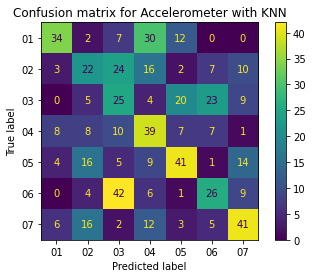
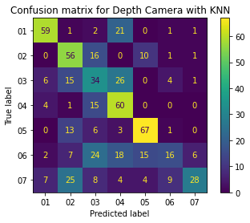
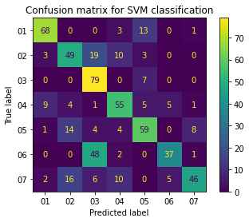
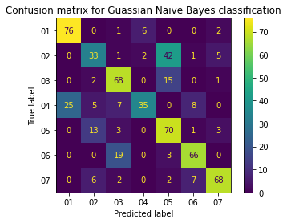
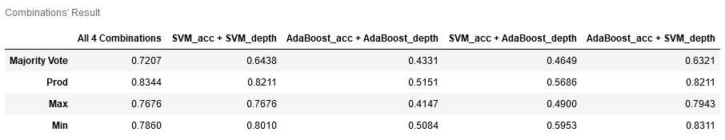
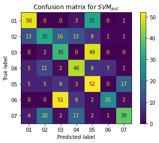
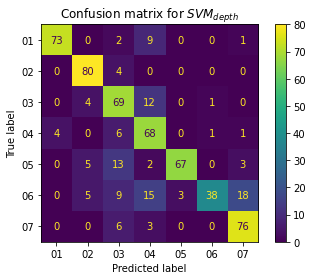
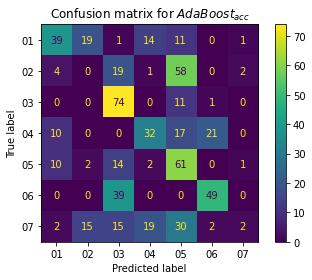
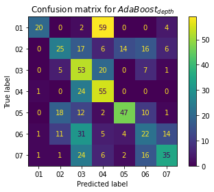

# Multi-Modal Data Fusion

This is a project for development of user-independent pre-processing and classification models for recognition of seven disparate physical exercises measured by **accelerometer** and **depth camera**. The following lists the steps that were required to reach the goal of the project:

* Data preparation, exploration and visualization
* Feature extraction and unimodal fusion for classification
* Feature extraction and feature-level fusion for multimodal classification
* Decision-level fusion for multimodal classification

# Visual Depictions

The followings show the end result of analyses and classifications.

## KNN Classifier

Confusion matrix for both accelerometer and depth camera is provided after dimensionality reduction with LDA and PCA.

### Accelerometer

We can see that the classifier did almost well for exercise number 07 and 05 and somehow 04 but the other exercises were not perfectly classified, specially exercise number 06 which was mistaken as exercise number 03 by the classifier.

### Depth Camera

Here we see that the classifier performs well on identifying exercise numbers 05, 04 and to some extent number 02 and 01. But for exercise number 06 and 07 the classifier seems to have chosen in a random manner. 

## Feature Extraction & Fusion

### SVM Classification

We could see that the prediction for exercise 01, 03, and 07 are done perfectly by SVM. Exercise 02 has the worst classification prediction as it is missclassified to be mostly exercise 07 and 03. Also the prediction for exercise numbers 04, 05 and 06 are not good enough too. 

### Gaussian Naive Bayes Classification

The Gaussian Naive Bayes classifier perfectly classified exercise 07, 06, 03 and 01. Other exercise types were not correctly classified with this classifier.

## Decision-Level Fusion

### Classification Rules

### Final Result

The followings show the final results of classification after all the phases have been processed:

#### SVM

##### Accelerometer

##### Depth Camera

#### AdaBoost

##### Accelerometer

##### Depth Camera

